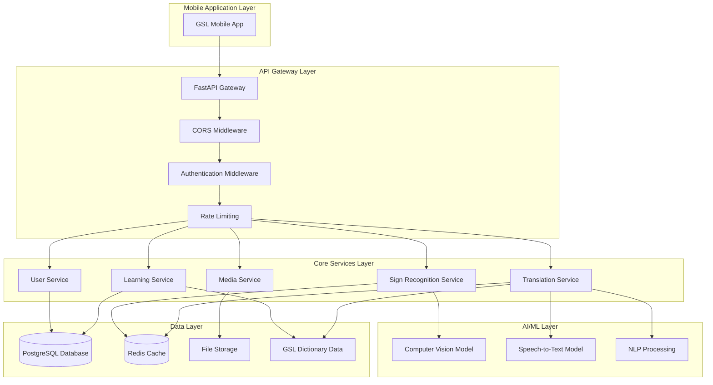

# Design Document

## Overview

The Ghanaian Sign Language (GSL) Backend is a FastAPI-based system that powers an AI-driven mobile application for learning and translating Ghanaian Sign Language. The system integrates computer vision models for gesture recognition, natural language processing for speech-to-text conversion, and a comprehensive digital representation of the Harmonized GSL dictionary to enable real-time bidirectional translation between sign language, speech, and text.

The architecture prioritizes offline-first functionality, low-bandwidth optimization, and cultural localization to ensure accessibility across Ghana, including rural and resource-limited environments.

## Architecture

### High-Level Architecture



### Service Architecture Pattern

The system follows a microservices-inspired modular architecture within a single FastAPI application, allowing for:
- Clear separation of concerns
- Independent scaling of AI-intensive operations
- Easier testing and maintenance
- Future extraction into separate services if needed

## Components and Interfaces

### 1. API Gateway Layer

**FastAPI Application**
- Main application entry point with automatic OpenAPI documentation
- Handles HTTP request routing and response formatting
- Integrates middleware for cross-cutting concerns

**Authentication Middleware**
- JWT-based token authentication
- User session management
- Role-based access control for different user types (learners, teachers, admins)

**Rate Limiting Middleware**
- Protects AI model endpoints from abuse
- Implements different limits for authenticated vs anonymous users
- Prioritizes educational use over commercial usage

### 2. Core Services

**User Service (`/api/v1/users`)**
```python
# Key endpoints:
POST /register          # Create new learner account
POST /login            # Authenticate and get token
GET /profile           # Get user profile and learning progress
PUT /profile           # Update user information
GET /progress          # Retrieve detailed learning analytics
```

**Sign Recognition Service (`/api/v1/recognition`)**
```python
# Key endpoints:
POST /recognize        # Upload video/image for gesture recognition
GET /confidence/{id}   # Get recognition confidence scores
POST /validate         # Validate user's gesture attempt
GET /similar/{gesture} # Get similar gestures for failed recognition
```

**Translation Service (`/api/v1/translate`)**
```python
# Key endpoints:
POST /speech-to-sign   # Convert audio to GSL signs
POST /text-to-sign     # Convert text to GSL signs
POST /sign-to-text     # Convert recognized gesture to text
GET /sign-video/{id}   # Retrieve sign demonstration video
```

**Learning Service (`/api/v1/learning`)**
```python
# Key endpoints:
GET /lessons           # Get structured lesson content
GET /lessons/{id}      # Get specific lesson details
POST /progress         # Update lesson completion
GET /achievements      # Get user badges and achievements
GET /dictionary        # Search GSL dictionary
```

**Media Service (`/api/v1/media`)**
```python
# Key endpoints:
POST /upload           # Upload media files
GET /video/{id}        # Stream video content
GET /compressed/{id}   # Get compressed media for low bandwidth
POST /process          # Process uploaded media for AI analysis
```

### 3. AI/ML Integration Layer

**Computer Vision Model Interface**
- Integrates with TensorFlow Lite models for gesture recognition
- Handles video frame extraction and preprocessing
- Manages model inference and confidence scoring
- Supports batch processing for efficiency

**Speech-to-Text Service**
- Integrates with Whisper or similar models
- Optimized for Ghanaian English accents
- Handles audio preprocessing and noise reduction
- Supports real-time streaming recognition

**Natural Language Processing**
- Text normalization and preprocessing
- Ghanaian language phrase detection
- Context-aware sign mapping
- Handles ambiguous text-to-sign translations

## Data Models

### User Models

```python
class LearnerAccount(BaseModel):
    id: UUID
    username: str
    email: str
    password_hash: str
    created_at: datetime
    last_login: datetime
    profile: LearnerProfile
    progress: LearningProgress

class LearnerProfile(BaseModel):
    full_name: str
    age_group: AgeGroup
    learning_level: LearningLevel
    preferred_language: str
    accessibility_needs: List[str]

class LearningProgress(BaseModel):
    total_lessons_completed: int
    current_level: int
    achievements: List[Achievement]
    practice_sessions: List[PracticeSession]
    last_activity: datetime
```

### GSL Dictionary Models

```python
class GSLSign(BaseModel):
    id: UUID
    sign_name: str
    description: str
    category: SignCategory
    difficulty_level: int
    video_url: str
    thumbnail_url: str
    related_signs: List[UUID]
    usage_examples: List[str]

class SignCategory(BaseModel):
    id: UUID
    name: str
    description: str
    parent_category: Optional[UUID]

class SignRecognitionResult(BaseModel):
    recognized_sign: Optional[GSLSign]
    confidence_score: float
    alternative_matches: List[Tuple[GSLSign, float]]
    processing_time: float
```

### Learning Content Models

```python
class Lesson(BaseModel):
    id: UUID
    title: str
    description: str
    level: int
    category: str
    signs_covered: List[GSLSign]
    tutorial_steps: List[TutorialStep]
    estimated_duration: int

class TutorialStep(BaseModel):
    step_number: int
    instruction: str
    demonstration_video: str
    practice_exercise: Optional[Exercise]
    completion_criteria: str

class Exercise(BaseModel):
    type: ExerciseType
    prompt: str
    expected_signs: List[GSLSign]
    validation_criteria: dict
```

## Error Handling

### Error Response Format

```python
class APIError(BaseModel):
    error_code: str
    message: str
    details: Optional[dict]
    timestamp: datetime
    request_id: str

# Standard error codes:
# AUTH_001: Invalid authentication token
# RECOG_001: Gesture recognition failed
# TRANS_001: Translation service unavailable
# MEDIA_001: Invalid media format
# RATE_001: Rate limit exceeded
```

### AI Model Error Handling

- **Model Unavailable**: Return cached results or fallback text descriptions
- **Low Confidence Recognition**: Provide multiple suggestions with confidence scores
- **Processing Timeout**: Implement async processing with status polling
- **Invalid Input**: Clear validation messages with format requirements

### Network and Performance Error Handling

- **Slow Network**: Automatic compression and progressive loading
- **Offline Mode**: Queue requests for later synchronization
- **High Load**: Graceful degradation with reduced AI features

## Testing Strategy

### Unit Testing
- **Service Layer**: Test each service independently with mocked dependencies
- **Model Integration**: Test AI model interfaces with sample data
- **Data Validation**: Comprehensive Pydantic model validation tests
- **Authentication**: JWT token generation and validation tests

### Integration Testing
- **API Endpoints**: Full request-response cycle testing
- **Database Operations**: Transaction handling and data consistency
- **AI Pipeline**: End-to-end gesture recognition and translation flows
- **File Upload**: Media processing and storage workflows

### Performance Testing
- **Load Testing**: Simulate concurrent users and AI model requests
- **Bandwidth Testing**: Verify low-bandwidth optimization effectiveness
- **Response Time**: Ensure sub-3-second response times for recognition
- **Memory Usage**: Monitor AI model memory consumption

### Accessibility Testing
- **Offline Functionality**: Test data synchronization and caching
- **Low-Resource Devices**: Performance on limited hardware
- **Network Resilience**: Behavior under poor connectivity conditions
- **Cultural Accuracy**: Validate GSL dictionary content and translations

### Security Testing
- **Authentication**: Token security and session management
- **Input Validation**: Protection against malicious file uploads
- **Rate Limiting**: Abuse prevention and fair usage enforcement
- **Data Privacy**: Ensure user data protection and GDPR compliance

## Deployment and Infrastructure

### Development Environment
- **Local Setup**: Docker Compose with PostgreSQL, Redis, and FastAPI
- **AI Models**: Local TensorFlow Lite models for development
- **File Storage**: Local filesystem with S3-compatible interface

### Production Environment
- **Container Orchestration**: Docker containers with health checks
- **Database**: Managed PostgreSQL with automated backups
- **Caching**: Redis cluster for session and recognition caching
- **File Storage**: Cloud storage with CDN for video content
- **Monitoring**: Application performance monitoring and logging

### Scalability Considerations
- **Horizontal Scaling**: Stateless service design for load balancing
- **AI Model Optimization**: Model quantization and edge deployment
- **Database Optimization**: Read replicas and connection pooling
- **Content Delivery**: Geographic distribution of video content